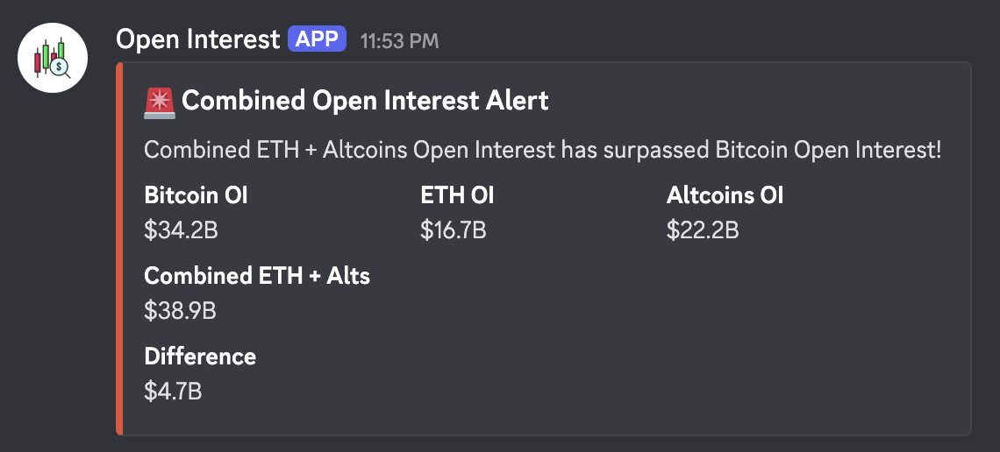

## A Discord bot that fetches real-time Open Interest data for market insights.

### Market Tip:

Be cautious when `ETH + Alts OI > BTC OI` especially if you are in leveraged trade.

Bot in Action:



## To access this bot in your server

- First add the bot to your server
- type `/btc` to get Bitcoin Open Interest
- type `/eth` to get Ethereum Open Interest
- type `/alt` to get Altcoin Open Interest
- If ETH OI + Altcoins OI > BTC OI, it sends an alert to your Discord channel.

## To run locally

Prerequisite:

- Python 3.12 or earlier

as the audioop module is a standard library module that was removed in Python 3.13. The discord.py library still depend on it for voice features, even if you don't use voice.

### To fix

- Create a new virtual environment with Python 3.12:

```bash
python3.12 -m venv venv
```